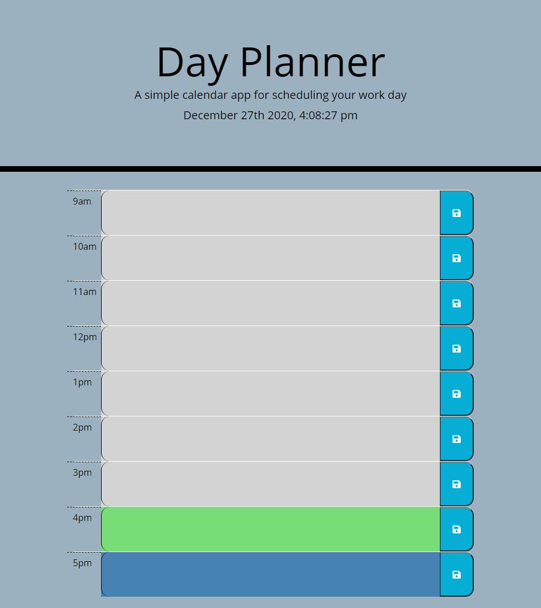

# Day Planner

This is a responsive application designed to use client-side storage in order to allow the user to save notes for each hour of the business day. The time blocks are color-coded to allow the user to see which hours are in the past and future, as well as which hour they are currently working in.

# Technologies used:
* HTML
* CSS
* Javascript
* jQuery
* Moment.js

# Deployment: 

 * Deployed Application Url: https://jaymemizelle.github.io/day-planner/
